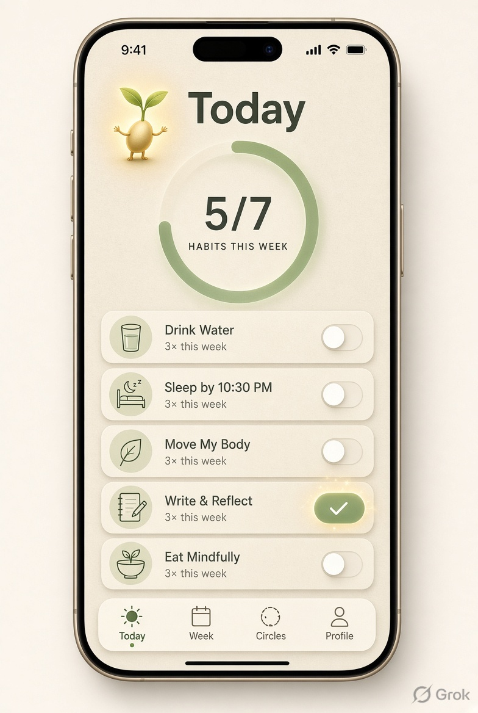
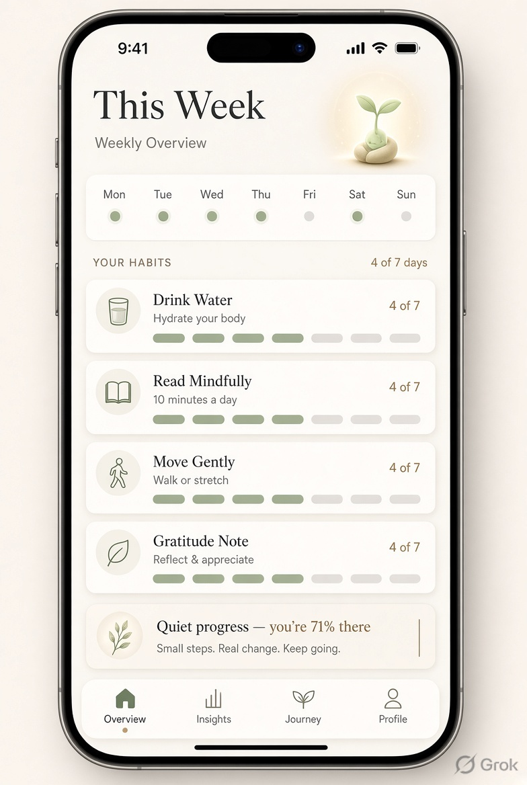
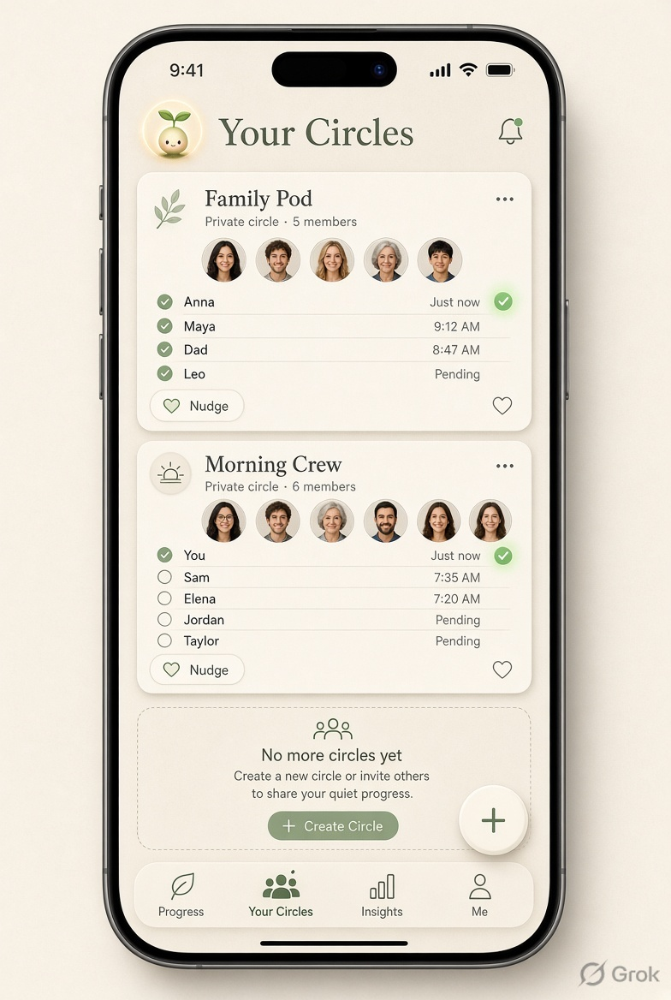
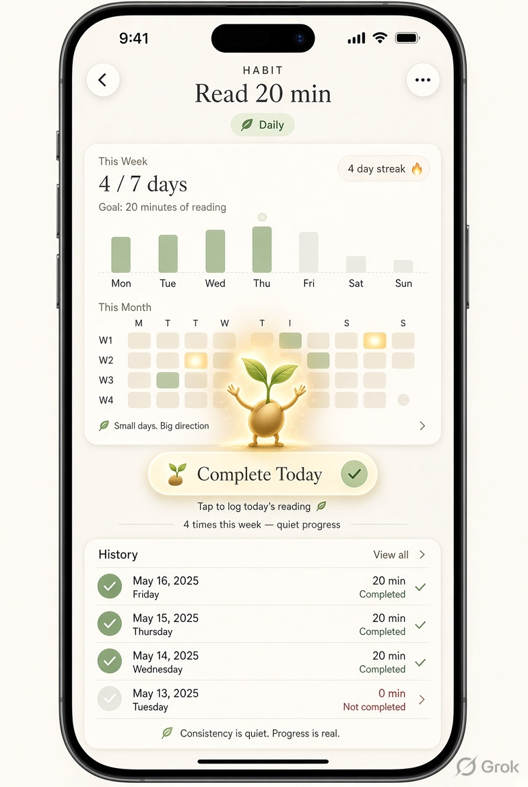

# Sprout — Quiet Progress

A calm, offline-first habit tracker built with Expo Router. Warm paper backgrounds, a soft sage-green accent system, and a small sprout mascot that grows alongside your streaks — no accounts, no network calls, no noise.

> "Small days. Big direction." — the app's own tagline, and basically its whole design philosophy.

## Screenshots

<table>
  <tr>
    <td align="center"><br /><sub><b>Today</b></sub></td>
    <td align="center"><br /><sub><b>This Week</b></sub></td>
    <td align="center"><br /><sub><b>Your Circles</b></sub></td>
    <td align="center"><br /><sub><b>Habit Detail</b></sub></td>
  </tr>
</table>

*(These are the source designs the app was built to match pixel-for-pixel — see [DESIGN_SYSTEM.md](DESIGN_SYSTEM.md) for the full token/component breakdown.)*

## Features

- **Today** — a weekly-consistency ring plus one-tap habit toggles, with a soft glow celebrating each completion
- **This Week** — a Mon–Sun activity strip and per-habit weekly progress bars
- **Your Circles** — private accountability groups: nudge someone, like a circle, see who's done today
- **Habit Detail** — a real weekly bar chart, a monthly completion heatmap (streak days highlighted in amber), full history, and the "Complete Today" CTA
- **Offline by default** — every read/write goes through a local AsyncStorage-backed store; nothing in the app makes a network request

## Tech stack

- [Expo](https://expo.dev) SDK 57 + [Expo Router](https://docs.expo.dev/router/introduction/) (file-based navigation)
- React Native 0.86, TypeScript (strict)
- [Reanimated](https://docs.swmansion.com/react-native-reanimated/) for the ring sweep, toggle glow, breathing CTA, and streak-highlight pulse
- `react-native-svg` for the animatable progress ring and mascot glow
- `@react-native-async-storage/async-storage` for local-first persistence (see [Data layer](#data-layer))
- Custom design system — see [`DESIGN_SYSTEM.md`](DESIGN_SYSTEM.md), [`constants/theme.ts`](constants/theme.ts), [`constants/colors.ts`](constants/colors.ts)

## Getting started

```bash
npm install
npx expo start        # then press i / a / w, or scan the QR code with Expo Go
```

Or target a platform directly:

```bash
npm run ios
npm run android
npm run web
```

## Project structure

```
app/                  Expo Router screens (file-based routing)
  (tabs)/             Today, This Week, Your Circles, Profile — the bottom tab bar
  habit/[id].tsx       Habit detail (pushed from any habit row)
components/ui/         Reusable design-system components (ProgressRing, HabitCard, CircleCard, ...)
constants/             theme.ts, colors.ts — the design system's tokens
data/                  Local-first data layer (see below)
lib/date.ts             Date-math helpers used by the data layer
DESIGN_SYSTEM.md        Full design system documentation
```

## Data layer

Habits, completions, and circles are modeled as plain data and persisted locally — no backend:

- `data/types.ts` — the persisted shapes
- `data/storage.ts` — a thin AsyncStorage ↔ JSON wrapper
- `data/seed.ts` — first-run-only seed data (runs once, only if nothing is persisted yet)
- `data/selectors.ts` — pure functions that derive everything the UI shows (streaks, weekly stats, chart heights, the heatmap) from the raw completions map, rather than storing them redundantly
- `data/DataProvider.tsx` + `data/hooks.ts` — a React Context provider and the screen-shaped hooks (`useTodayHabits`, `useWeekOverview`, `useHabitDetail`) that consume it

Everything you do in the app — toggling a habit, liking a circle — persists across restarts.

## License

MIT — see [LICENSE](LICENSE).
